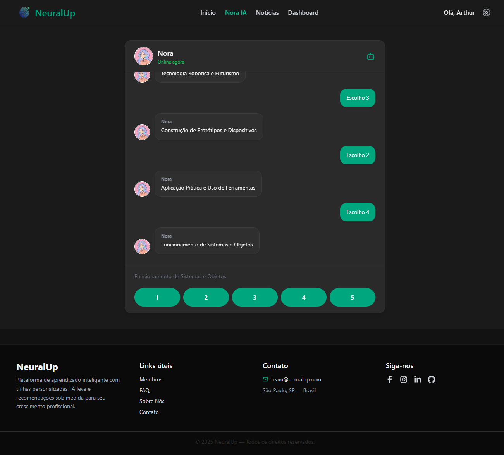

# 🧠 NeuralUp — Sistema de Análise e Treinamento Neural

## 📌 Título e Descrição

**NeuralUp**  

NeuralUp é um sistema que identifica a área de atuação mais compatível com o perfil de cada pessoa e recomenda cursos para desenvolver as habilidades necessárias, ajudando no crescimento profissional de forma prática e personalizada.

## 📌 Status do Projeto

🚧 Concluído para entrega

## 📌 Sumário

- Sobre o Projeto
- Tecnologias Utilizadas
- Instalação
- Como Usar
- Estrutura de Pastas
- Endpoints / Fluxo Principal
- Autores e Créditos
- Screenshots / Demonstração
- Contato
- Links (GitHub e YouTube)

## 📌 Sobre o Projeto

O **NeuralUp** tem como objetivo identificar a área de atuação mais adequada para cada pessoa com base em seu perfil, além de recomendar cursos para desenvolvimento de habilidades necessárias. Criado para orientação profissional e aprendizado personalizado, o sistema permite:

- Análise de perfil do usuário
- Identificação da área de atuação mais compatível
- Sugestão de cursos para aprimoramento
- Acompanhamento do progresso e aprendizado

## 📌 Tecnologias Utilizadas

- Banco de dados Oracle
- Python para API do bot
- Java para API de login e cadastro
- React
- Vite

## 📌 Instalação

git clone https://github.com/Global-Solution-II-2025/Front-end.git
npm i

## 📌 Como Usar

- npm run dev
- acessar a página da Nora IA
- responder perguntas de acordo com a opinião do usuário
- verificar área de atuação mais adequada para o usuário do sistema

## 📌 Estrutura de Pastas

```md
PROJETO-PRINCIPAL/
├── node_modules/
├── public/
│   └── favicon.png
├── src/
│   ├── api/
│   │   ├── JavaApi.ts
│   │   ├── newsApi.ts
│   │   └── pythonApi.ts
│   ├── assets/
│   │   └── img/
│   │       ├── brito.jpg
│   │       ├── brum.jpeg
│   │       ├── flosi.jpg
│   │       ├── login-bg.jpg
│   │       └── noraia.png
│   ├── components/
│   │   ├── layout/
│   │   │   ├── Footer.tsx
│   │   │   └── Header.tsx
│   │   │   ├── Menu.tsx
│   │   ├── ui/
│   │   │   └── Message.tsx
│   │   ├── context/
│   │   ├── ThemeContext.tsx
│   │   └── useTheme.ts
│   ├── pages/
│   │   ├── About.tsx
│   │   ├── Contact.tsx
│   │   ├── Dashboard.tsx
│   │   ├── Faq.tsx
│   │   ├── Home.tsx
│   │   ├── Login.tsx
│   │   ├── Members.tsx
│   │   ├── News.tsx
│   │   ├── NoraIA.tsx
│   │   ├── Privacy.tsx
│   │   └── Terms.tsx
│   ├── routes/
│   │   └── AppRoutes.tsx
│   ├── types/
│   │   ├── gnews.d.ts
│   │   ├── integrantes.ts
│   │   └── themeContext.ts
│   ├── App.tsx
│   └──global.css
│   └── main.tsx
├── .env
├── .eslintignore
├── .eslintrc.json
├── index.html
├── package-lock.json
├── package.json
├── postcss.config.cjs
├── README.md
├── tailwind.config.js
├── tsconfig.app.json
├── tsconfig.json
├── tsconfig.node.json
└── vite.config.ts
```

## 📌 Endpoints / Fluxo Principal

Arquivo funcão - Etapa
-	npm run dev
-	/Login - Página Login
- /Home - Página Home
-	/NoraIA - Página NoraIA
-	/NoraIA - Responder perguntas
-	/NoraIA - Verificar Área 

## 📌 Autores e Créditos

Arthur Brito da Silva
FIAP • ADS 1º Ano - 2° Semestre
Desenvolvedor Frontend e Database
Desenvolvedor frontend, responsável pela modelagem e manutenção do banco de dados e documentação geral do projeto.

Luiz Felipe Flosi dos Santos
FIAP • ADS 1º Ano - 2° Semestre
Tech Lead do projeto e API
Tech Lead do projeto NeuralUp, desenvolvedor frontend, responsável pelo desenvolvimento da API de python e integrações das APIs.

Pedro Henrique Brum Lopes
FIAP • ADS 1º Ano - 2° Semestre
Desenvolvedor Backend
Especialista em desenvolvimento API e fanático por Java.

## 📌 Screenshots / Demonstração

  Chatbot Nora realizando avaliação com perguntas:
  

  Login
  

  Cadastro
  


## 📌 Contato
### Email:
- 📧 britoarthur150@gmail.com
- 📧 luizfelipeflosi@gmail.com
- 📧 pbrum191@gmail.com

### LinkedIn:
- 💼 LinkedIn: https://www.linkedin.com/in/arthur-brito-da-silva-06658b276/
- 💼 LinkedIn: https://www.linkedin.com/in/felipeflosii/
- 💼 LinkedIn: https://www.linkedin.com/in/pedro-brum-66a31b326/

## 🌐 Links

🔗 GitHub
https://github.com/Global-Solution-II-2025/Front-end

🎥 Vídeo no YouTube
https://youtube.com/seu-video